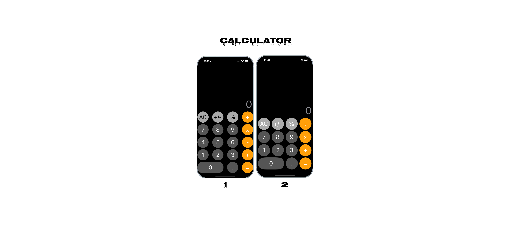

# Calculator

  Build a simple single-page calculator. It should have numbers from 0 to 9, plus, minus, divide, and multiply buttons with their actions. Also, a label to show the result of the process.

  Get familiar with communication between the controller and its view Align UI components regularly Understand the logic mechanism in the controller Make a meaningful, tidy folder structure.

Thanks for idea https://github.com/meyusufdemirci .

## Built With
- [Swift](https://developer.apple.com/swift/)
- [UIKit](https://developer.apple.com/documentation/uikit)

  

## Overview
* Uses UIKit
* Designed with MVC pattern
* No External Dependencies
* Auto layout Based

## Design
The app has three key area that we will build out step-by-step
1. UICollectionCalculatorViewController: Using UICollectionView for CalculatorButtons and operations.
2. UIStackCalculatorViewController: Using UIStackView for CalculatorButtons and operations.

